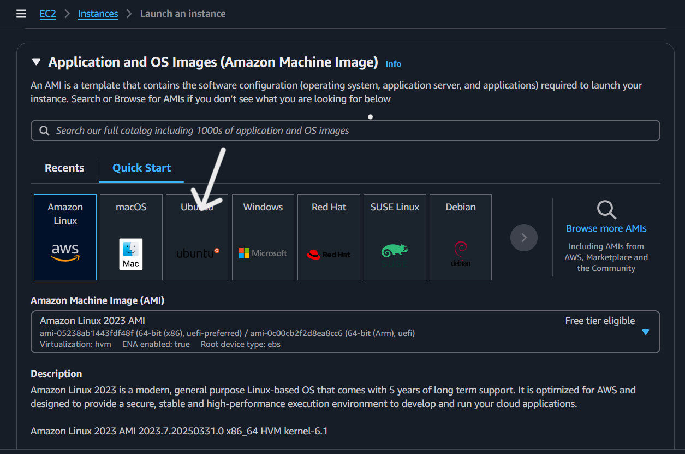
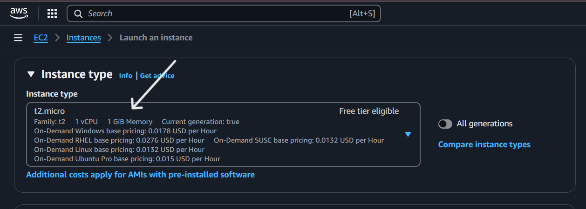

# What is a LAMP stack?
---
**Step 0 - Preparing prerequisites**

In order to complete this project you will need an AWS account and a virtual server with Ubuntu Server OS.

[AWS](https://aws.amazon.com/) is the biggest Cloud Service Provider and it offers a free tier account that we are going to leverage for our projects.

Do not focus too much on AWS itself right now, there will be a proper Cloud introduction and configuration projects later in our course.

Right now, all we need to know is that AWS can provide us with a free virtual server called [EC2 (Elastic Compute Cloud)](https://aws.amazon.com/ec2/features/) for our needs.

A **LAMP** stack is a bundle of four different software technologies that developers use to build websites and web applications. LAMP (as learnt in previous lecture) is an acronym for the operating system - Linux, the web server - Apache, the database server - MySQL, and the programming language - PHP. All four of these technologies are open source, which means they are community maintained and freely available for anyone to use. Developers use LAMP stacks to create, host, and maintain web content. It is a popular solution that powers many of the websites you commonly use today.

Linux Linux is an open-source operating system that you can install and configure to meet different application requirements. Linux sits at the first level of the LAMP stack and supports other components on the upper layers.

In order to complete this project, you will need an AWS account and a virtual server with Ubuntu Server OS. NB; AWS is not the focus now, all we need to know now is that AWS can provide us with a free virtual server called [EC2 (Elastic Compute Cloud)](https://aws.amazon.com/ec2/features/) for our needs.

Follow the instructions below.

Step 1: Set Up Your AWS Account

1. Create an AWS Account: If you don’t already have one, sign up at AWS [this instruction](https://repost.aws/knowledge-center/create-and-activate-aws-account).
2. Access the AWS Management Console: Log in to the AWS Management Console where you’ll manage your services.

Step 2: Launch an EC2 Instance

1. In the AWS Management Console, go to the EC2 Dashboard.
2. Click "Launch instances" to start the setup process.

3. Select your preferred region (the closest to you) to launch an instance
4. Select an AMI that supports LAMP stack, such as Ubuntu.
5. Choose an EC2 instance type like _t2.micro_ (eligible for the free tier). Please read information about AWS [free tier limits](https://aws.amazon.com/free/?all-free-tier.sort-by=item.additionalFields.SortRank&all-free-tier.sort-order=asc) and make sure that you ***STOP*** your EC2 instance when you are not using it.

6. Select _Create new key pair_.

7. Tag your instance with a name like "LAMP-Stack". Explanation: Tags help identify and organize resources.
8. Create a security group that allows HTTP - port 80 _(default port that web browsers use to access web pages on the Internet)_ and SSH (port 22) traffic.

9. Leave the rest of the settings as default

Step 3: Connect to Your Instance

1. Download the _.pem_ file when launching the instance.
- Explanation: The key pair is used for SSH authentication. ssh uses the [SSH protocol](https://en.wikipedia.org/wiki/Secure_Shell) to create secure connections between computers. This protocol is highly secure because it uses cryptographic algorithms to encrypt transmitted data. It operates on TCP port 22, which is open by default on all newly created EC2 instances in AWS. These technical terms might seem overwhelming at first, but don’t worry if they don’t make immediate sense. Rest assured, this information is now stored in your subconscious mind and will become clearer as you progress.
2. Use an SSH client to connect to your instance: we are going to use that PEM key to connect to our EC2 Instnace via ssh.
- Change directory into the loacation where your `PEM` file is. Most likely will be in the Downloads folder `cd ~/Downloads`
- Change premissions for the private key file (.pem) `sudo chmod 400 <private-key-name>.pem`
- Connect to the instance by running `ssh -i <private-key-name>.pem ubuntu@<Public-IP-address>`

Congratulations! You have just created your very first Linux Server in the Cloud and the set up looks like this now: (You are the client)

NB; that every time you stop and start your EC2 instance - you will have a new IP address, it is normal behavior, so do not forget to update your SSH credentials when you try to connect to your EC2 server.

It is the same content that you got by 'curl' command, but represented in nice [HTML](https://en.wikipedia.org/wiki/HTML) formatting by your web browser.

Please read information about AWS [free tier limits](https://aws.amazon.com/free/?all-free-tier.sort-by=item.additionalFields.SortRank&all-free-tier.sort-order=asc) and make sure that you ***STOP*** your EC2 instance when you are not using it, because if you don't, your free tier might get finished.

All we need to know right now is that we can use 750 hours (31.25 days) of t2.micro server per month for the first 12 months **FOR FREE**.

Let us move on and configure our EC2 machine to serve a Web server!