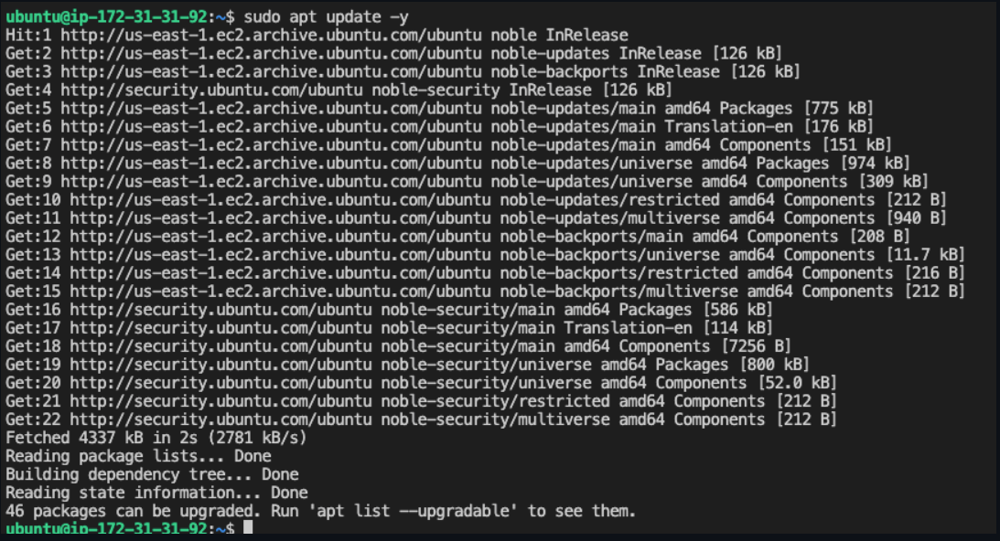
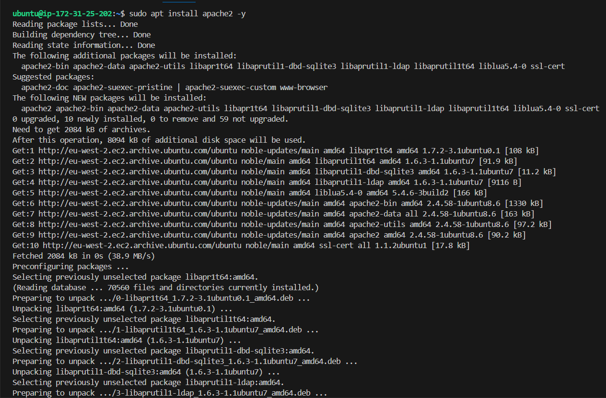
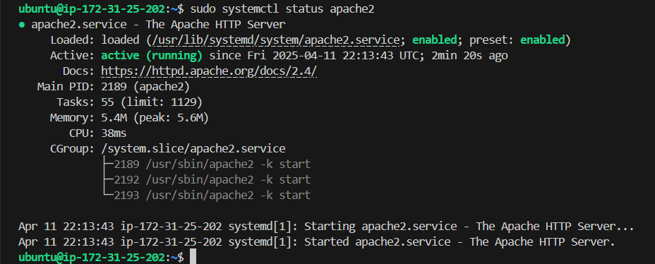
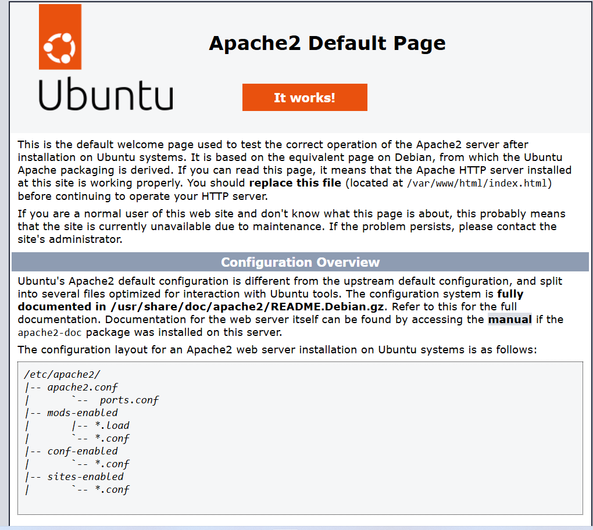

# Install Apache
## What is Apache;
Apache [Apache HTTP Server](https://httpd.apache.org/) is an open-source web server that forms the second layer of the LAMP stack. The Apache module stores website files and exchanges information with a browser using HTTP, an internet protocol for transferring website information in plain text. For example, when a browser requests a webpage, the Apache HTTP server does the following:
1. Receives the request
2. Processes the request and finds the required page file
3. Sends the relevant information back to the browser

We will install Apache using Ubuntu’s package manager ['apt']

4. Update Software Packages: Run;
``` bash
sudo apt update -y
```


5.  5. Install the Apache web server:
``` bash 
sudo apt install apache2 -y
```



6. Verify that apache2 is running as a Service in our OS
``` bash
sudo systemctl status apache2
```


If it is green and running, then you did everything correctly - you have just launched your first Web Server in the Clouds!

7. Verify Installation: Visit your instance’s public ``IP http://<Public-IP-Address>:80`` in a browser to see the Apache test page. OR Access it locally in our Ubuntu shell, curl ``http://localhost:80 curl http://127.0.0.1:80``

As we know, we have TCP port 22 open by default on our EC2 machine to access it via SSH, and port 80 to get access over the internet.

These 2 commands above actually do pretty much the same - they use _'curl'_ command to request our Apache HTTP Server on port 80 (actually you can even try to not specify any port - it will work anyway). The difference is that: in the first case we try to access our server via DNS name and in the second one - by IP address (in this case IP address 127.0.0.1 corresponds to [DNS name](https://en.wikipedia.org/wiki/Domain_Name_System) 'localhost' and the process of converting a DNS name to IP address is called "resolution"). We will touch DNS in further lectures and projects.

As an output you can see some strangely formatted test, do not worry, we just made sure that our Apache web service responds to 'curl' command with some payload.

Now it is time for us to test how our Apache HTTP server can respond to requests from the Internet. Open a web browser of your choice and try to access following url

```bash
http://<Public-IP-Address>:80
```

The URL in browser shall also work if you do not specify port number since all web browsers use port 80 by default.

If you see following page, then your web server is now correctly installed and accessible through your firewall.



In fact, it is the same content that you previously got by 'curl' command, but represented in nice [HTML](https://en.wikipedia.org/wiki/HTML) formatting by your web browser.


